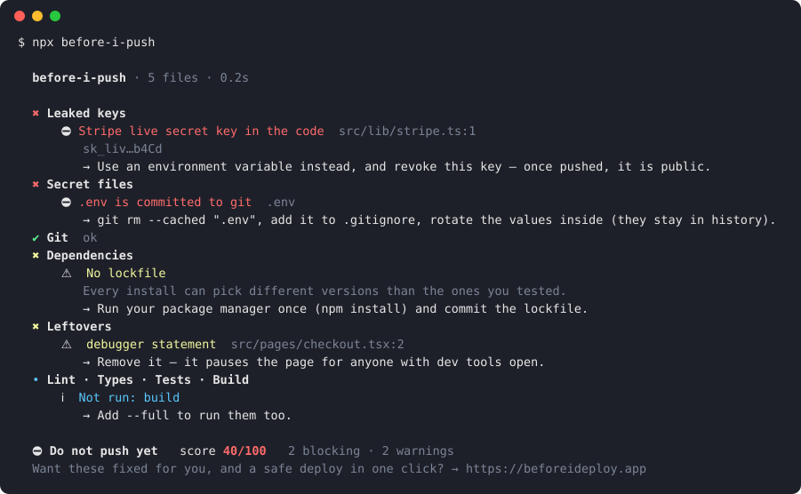

# before-i-push

**Catch leaked API keys, committed `.env` files and leftover debug code — before they reach GitHub.**

One command. Zero dependencies. Runs offline. Nothing leaves your machine.

```bash
npx before-i-push
```

<p align="center"></p>

[](https://github.com/yyakowvw/before-i-push/actions/workflows/ci.yml)


## Why

A pushed key is a public key. Bots scrape GitHub for AWS, Stripe and OpenAI keys within minutes, and
deleting the commit does not help — it is in the history and in every fork. `before-i-push` checks your
project in about a second and tells you, in plain words, what is wrong and how to fix it.

## What it checks

| Check | Finds |
|---|---|
| 🔑 **Leaked keys** | AWS, Stripe, GitHub, GitLab, OpenAI, Anthropic, Google, Slack, SendGrid, Twilio, Mailgun, npm, Netlify, Supabase service role, Discord, Telegram, private keys, passwords inside URLs |
| 🗝️ **Secret files** | `.env` files that are committed or not in `.gitignore`, `*.pem` / `*.key` / `id_rsa`, service-account JSON, `.npmrc` with a token |
| 🌿 **Git** | uncommitted changes, unresolved merges, branch behind its remote, committed `node_modules`, files over 5 MB, missing `.gitignore` |
| 📦 **Dependencies** | no lockfile, lockfiles from two package managers, `file:` dependencies that will not exist on the server, broken `package.json` — and `npm audit` with `--full` |
| 🧹 **Leftovers** | merge conflict markers, `debugger`, `it.only` / `describe.only`, `// TODO remove before deploy`, `console.log` in app code |
| 🏗️ **Lint · Types · Tests · Build** | with `--full`: runs your own `lint`, `typecheck`, `test` and `build` scripts and reports what fails |

Keys are always **masked** in the output (`sk_liv…b4Cd`), so the report is safe to paste or post in CI.
Obvious placeholders (`your-key-here`, `xxxx`, `AAAA…`) are ignored, and keys in test files are warnings,
not blockers.

## Use it

```bash
npx before-i-push              # check the current folder
npx before-i-push ./my-app     # check another folder
npx before-i-push --full       # also npm audit + lint, typecheck, test and build
npx before-i-push --strict     # fail on warnings too
npx before-i-push --json       # machine-readable report
npx before-i-push --markdown   # for PR comments and job summaries
```

Exit code `0` = OK to push, `1` = something blocking was found (or a warning with `--strict`), `2` = usage error.

### Check every push automatically

```bash
npx before-i-push --install-hook
```

Adds a git `pre-push` hook. A push with a leaked key is stopped before it leaves your machine.
Skip it once with `git push --no-verify`.

### GitHub Action

```yaml
# .github/workflows/before-i-push.yml
name: before-i-push
on: [pull_request]
permissions:
  contents: read
  pull-requests: write   # for the PR comment
jobs:
  check:
    runs-on: ubuntu-latest
    steps:
      - uses: actions/checkout@v4
      - uses: yyakowvw/before-i-push@v0.1.0
```

The report appears in the job summary and as one comment on the pull request, updated on every push.

| Input | Default | |
|---|---|---|
| `path` | `.` | folder to check |
| `full` | `false` | also audit and run your scripts (install dependencies first) |
| `strict` | `false` | fail on warnings too |
| `comment` | `true` | post the report on the pull request |

Outputs: `score` (0–100) and `verdict` (`ready`, `warnings`, `blocked`).

### Badge

```bash
npx before-i-push --badge badge.json
```

writes a [shields.io endpoint](https://shields.io/badges/endpoint-badge) file. Commit it (or publish it from
CI) and show your score:

```markdown

```

## Configure

`.beforeipushrc.json` in the project root (or a `"beforeIPush"` key in `package.json`):

```json
{
  "ignore": ["fixtures/**", "*.snap"],
  "checks": { "leftovers": false }
}
```

Check ids: `secrets`, `env`, `git`, `deps`, `leftovers`, `scripts`. Skip one from the command line with
`--skip leftovers,git`.

Silence a single line:

```js
const demoKey = 'AKIA…'; // before-i-push: ignore
```

## Use it from code

```js
import { scan } from 'before-i-push';

const report = await scan('./my-app', { full: false });
console.log(report.verdict, report.score); // 'blocked' 40
```

## Found a key? Do this

1. **Revoke it** in the provider's dashboard and create a new one. Removing it from the code is not enough.
2. Move the new key to an environment variable (`process.env.STRIPE_KEY`) and keep `.env*` in `.gitignore`.
3. If it was already pushed, assume it is compromised — check the provider's logs for use you do not recognise.

## How it compares

`before-i-push` is not a replacement for [gitleaks](https://github.com/gitleaks/gitleaks) or
[trufflehog](https://github.com/trufflesecurity/trufflehog), which scan full git history with hundreds of
rules. It is the quick, friendly check you run on every push: secrets **and** the other things that make a
release go wrong, explained in plain words, with nothing to install.

## Contributing

New key patterns and false-positive reports are very welcome — see [CONTRIBUTING.md](CONTRIBUTING.md).

```bash
git clone https://github.com/yyakowvw/before-i-push && cd before-i-push
npm test          # node:test, no install needed
```

## License

MIT

---

Made by the team behind **[Before I Deploy](https://beforeideploy.app)** — the app that checks your project,
fixes what it finds with AI, and deploys it to Netlify, Vercel, Cloudflare or GitHub Pages in one click.
